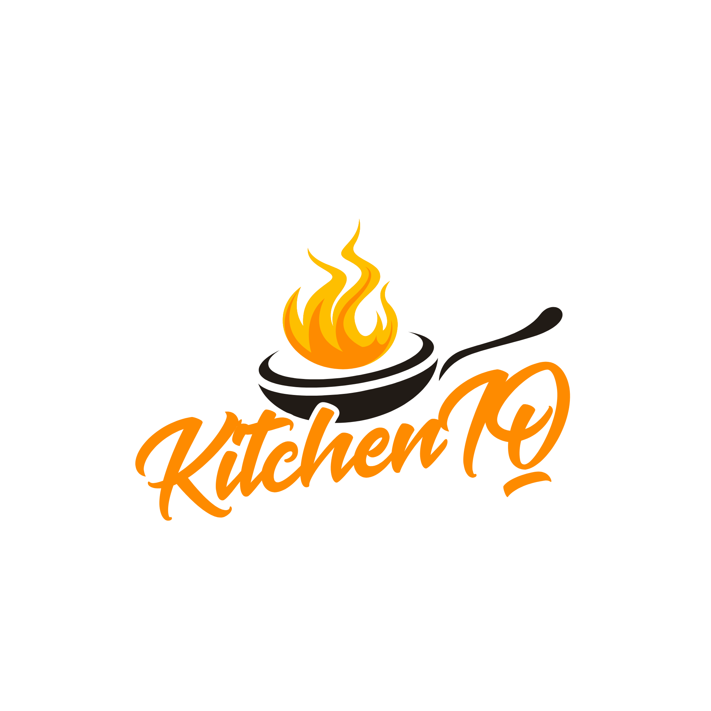

# 🚀 KitchenIQ: Proactive AI Intelligence for Sustainable Culinary Operations



**KitchenIQ** is an AI-powered food ordering and decision support system designed to place intelligence at the center of vendor operations. By bridging the gap between customer demand and supply chain management, KitchenIQ empowers kitchens to transition from "reactive" to "proactive" management.

---

## 🌪️ The Challenge: The "Guesswork" Crisis
Food waste and operational inefficiency cost the global food industry billions annually. Small restaurants and cloud kitchens currently operate on intuition, leading to a **"double-loss" scenario**: overproduction results in massive food waste, while under-preparation leads to missed revenue and frustrated customers. 

## 💡 The Solution: An Intelligence-First Ecosystem
KitchenIQ is not just an ordering platform—it is a **Culinary Decision Engine**. By integrating a high-performance Spring Boot backend with a predictive AI layer, KitchenIQ transforms raw order data into a live operational roadmap.

---

## ✨ Key Innovations & Features

### 🔮 1. Predictive Demand Forecasting
Utilizing historical day-wise and time-slot trends, KitchenIQ generates precise production targets, ensuring kitchens prepare exactly what they will sell.

### 🌱 2. AI-Driven Waste Mitigation (SDG 12)
A smart **Expiration Alert** system that monitors inventory shelf-life. It triggers proactive alerts and suggests menu "specials" for ingredients nearing expiration, turning potential waste into profit.

### ⏳ 3. Live Operational Load-Balancing & Surge Pricing
A real-time "Kitchen IQ" score calculates estimated prep times based on queue density. If the kitchen becomes overwhelmed, the system automatically activates **AI-Driven Surge Pricing**, dynamically increasing margins while naturally throttling demand.

### 👑 4. VIP Customer Retention AI
Automatically tracks ordering habits and identifies "VIP Customers", suggesting targeted loyalty discounts to maximize lifetime value (LTV).

### 📊 5. High-Fidelity Executive Dashboard
A professional, data-rich interface providing instant visibility into peak hours, item-level performance, and sustainability metrics.

---

## 🛠️ Technical Architecture

### **Backend: Robust & Scalable**
- **Spring Boot 3.x:** Enterprise-grade Java framework for high-concurrency order handling.
- **MySQL / JPA:** Persistent relational data management for complex inventory & orders.
- **JWT Security:** Secure, stateless authentication for vendor privacy.
- **AI Prediction Layer:** Custom logic for demand forecasting and prep-time estimation.

### **Frontend: Modern & Responsive**
- **React 19:** Utilizing the latest concurrent rendering features.
- **Tailwind CSS v4:** Cutting-edge utility-first styling for a sleek, "startup" aesthetic.
- **Recharts:** High-performance data visualization for AI demand forecasting.
- **Lucide Icons:** Clean, professional iconography.

---

## 🚀 Getting Started

### **Prerequisites**
- Java 17+
- Node.js 18+
- MySQL Server

### **Backend Setup**
1. Configure your database in `src/main/resources/application.properties`.
2. Run with Maven:
   ```bash
   ./mvnw spring-boot:run
   ```

### **Frontend Setup**
1. Navigate to the `frontend` directory.
2. Install dependencies:
   ```bash
   npm install
   npm install @tailwindcss/postcss lucide-react --save-dev
   ```
3. Run the development server:
   ```bash
   npm run dev
   ```

---

## 🌍 Impact: Profitability Meets Sustainability
By digitizing intuition, KitchenIQ helps small businesses reduce food waste by up to **30%**, increase profit margins, and contribute directly to global sustainable food practices. KitchenIQ provides professional-grade AI tools to the vendors who need them most.

---
*Created for Hackathons and Startup Competitions to empower the future of food.*